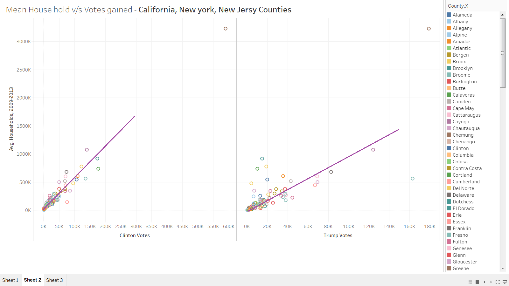

# 2016 Primary Election Results

## Read 2016 primary election results data. 
```{r message=FALSE}
library(knitr)
library(kableExtra)# manipulate table styles
suppressMessages(library(tidyverse))
pr_df <- read.csv(file="https://raw.githubusercontent.com/che10vek/Data-607-Assignments/master/Primary_Results2016%20(1).csv", header=TRUE, sep=",")
head(pr_df)
tail(pr_df)
dim(pr_df)
```

## Spreading the dataset to move candidate votes and fraction data from rows to columns. 
```{r}
#The code was adapted from the following help page: https://community.rstudio.com/t/spread-with-multiple-value-columns/5378
pr_df$party <- NULL
pr_df_wide <- pr_df %>%
    gather(variable, value, -(state:candidate)) %>%
    unite(temp, candidate, variable) %>%
    spread(temp, value)
head(pr_df_wide)
dim(pr_df_wide)
```

## Now let's create a new dataframe with only the data for the 4 candidates we are intersted in: Bernie Sanders, Hillary Clinton, Ted Cruz, and Donald Trump. 

```{r}
new_pr_df <- data.frame(pr_df_wide$state, pr_df_wide$state_abbreviation, pr_df_wide$county, pr_df_wide$fips, pr_df_wide$`Bernie Sanders_fraction_votes`, pr_df_wide$`Bernie Sanders_votes`, pr_df_wide$`Hillary Clinton_fraction_votes`, pr_df_wide$`Hillary Clinton_votes`, pr_df_wide$`Donald Trump_fraction_votes`, pr_df_wide$`Donald Trump_votes`, pr_df_wide$`Ted Cruz_fraction_votes`, pr_df_wide$`Ted Cruz_votes`)
names(new_pr_df) <- c("state", "state_abbr", "county", "fips", "sanders fraction votes", "sanders votes", "clinton fraction votes", "clinton votes","trump fraction votes", "trump votes", "cruz fraction votes", "cruz votes")
head(new_pr_df)
dim(new_pr_df)

write.csv(new_pr_df,'new_pr_df.csv')
```

# Demographic Dataset

### The dataset contains demographic data on US counties related to the 2016 US Primary Presidential Election.

### The dataset contains several main files. The data may be downloaded from the url: https://www.kaggle.com/benhamner/2016-us-election

## Read the data
```{r}
facts <- read.csv(file="https://raw.githubusercontent.com/bsosnovski/Project3/master/County_Facts.csv", header=TRUE, sep=",")
glimpse(facts, width = getOption("width"))

headers <- read.csv(file="https://raw.githubusercontent.com/bsosnovski/Project3/master/Headers.csv", header=TRUE, sep=",", stringsAsFactors = F)
glimpse(headers, width = getOption("width"))
```

## Tidying the data

### The dataset contains rows with total figures for each state and for the country. Because we can use the summary function to obtains these figures, and also to facilitate the data reading, we filter these rows out. To do so, we note that such rows have the variable state_abbreviation with blanks.

```{r}
facts <- facts %>% filter(state_abbreviation!="")
kable(head(facts))%>% kable_styling(bootstrap_options = c("striped", "condensed"))
```

### The file Headers.csv contains the description to what some of the variables are. We replace the codes in the headers of the data accordingly.

```{r}
# Function that matches the code in the dataframe column
# and replace it with dictionary value
new.headers <- function(headers,facts){
        n <- nrow(headers)
        for (i in seq(n)){
                col.Ind <- which(colnames(facts)==headers[i,1])
                colnames(facts)[col.Ind] <- headers[i,2]
        }
        return(facts)
}

facts2 <- new.headers(headers,facts)
kable(head(facts2))%>% kable_styling(bootstrap_options = c("striped", "condensed"))
```


#Merging the demographic data and the primary election results data. 

## Determine what keys will foster the optimal join 

### Left join by county and state
```{r join demographic and primary election result data}

facts2$county <- sapply(facts2$area_name , function(x) {
  str_replace_all(x, " County" , "")
})

typeof(facts2$county) #Data type of county in facts2
typeof(new_pr_df$county) #Data type of county in new_pr_df
new_pr_df$county <- as.character(new_pr_df$county) # Convert county in new_pr_df to character

typeof(facts2$state_abbreviation) #Data type of the state abbreviation in facts2
typeof(new_pr_df$state_abbr)  #Data type of the state abbreviation in new_pr_df
facts2$state_abbreviation <- as.character(facts2$state_abbreviation) # Convert county in new_pr_df to character
new_pr_df$state_abbr <- as.character(new_pr_df$state_abbr) # Convert county in new_pr_df to character

#Trim white space around character data
facts2$state_abbreviation <- trimws(facts2$state_abbreviation)
new_pr_df$state_abbr <- trimws(new_pr_df$state_abbr)
facts2$county <- trimws(facts2$county)
new_pr_df$county <- trimws(new_pr_df$county)

#Left join by count and state abbreviation
complete_data <- left_join(new_pr_df, facts2, by = c("county", "state_abbr" = "state_abbreviation" ))
```

#### Dimensions of merged data and original data.
```{r}
dim(new_pr_df) # Dimension of primary election data
dim(facts2) # Dimensions of the demographic data, which is organized on the county level. 
dim(complete_data) # Dimensions of the two datasets merged by an inner join, which is a left join that creates a dataset that only contains exact matches across the two data frame.
unique(complete_data$state_abbr) # Listed here are the states that were accurately joined. 
```

#### Where did the two data frames not match (i.e. the rows with NA values).
```{r}
anyNA(complete_data) #There are missing values

#Create a subset of the merged data that only contains those rows where there are NA values.
df_did_not_match <- subset(complete_data, is.na(complete_data$area_name))
dim(df_did_not_match) #There are 1491 rows where the primary election data did not match the demographic data

df_did_not_match$fips_length <- sapply(df_did_not_match$fips.x, nchar)
unique(df_did_not_match$fips_length) #In the df_did_not_match subset, there are FIPS code 4, 5, and 8 digits in length. 

count((subset(df_did_not_match, fips_length==4))) #Number of fips codes that are 4 digits long
count((subset(df_did_not_match, fips_length==5))) #Number of fips codes that are 5 digits long
count((subset(df_did_not_match, fips_length==8))) #Number of fips codes that are 8 digits long

unique(df_did_not_match$state) #States that did not properly match. 
```


### Left join by fips code. As shown below, this merge leads to better results. Rather than 1491 rows not matching as was the case when joining by the state and county, using the FIPS code as join by key leads to 1419 rows to not match. On top of this, when joining by the FIPS code a mere 11 states' primary election results do not accurately match.
```{r}
complete_data <- left_join(new_pr_df, facts2, by = c("fips"))

#### Dimensions of merged data and original data.

dim(new_pr_df) # Dimension of primary election data
dim(facts2) # Dimensions of the demographic data, which is organized on the county level. 
dim(complete_data) # Dimensions of the two datasets merged by an inner join, which is a left join that creates a dataset that only contains exact matches across the two data frame.
unique(complete_data$state_abbr) # Listed here are the states that were accurately joined. 

#### Where did the two data frames not match (i.e. the rows with NA values).

anyNA(complete_data) #There are missing values

#Create a subset of the merged data that only contains those rows where there are NA values.
df_did_not_match <- subset(complete_data, is.na(complete_data$area_name))
dim(df_did_not_match) #There are 1419 rows where the primary election data did not match the demographic data. This is compared to the 1491 rows that did not match when using state and county names. 

df_did_not_match$fips_length <- sapply(df_did_not_match$fips, nchar)
unique(df_did_not_match$fips_length) #In the df_did_not_match subset, are only FIPS code 8 digits in length and observations without a FIPS code.

count((subset(df_did_not_match, fips_length==4))) #Number of fips codes that are 4 digits long
count((subset(df_did_not_match, fips_length==5))) #Number of fips codes that are 5 digits long
count((subset(df_did_not_match, fips_length==8))) #Number of fips codes that are 8 digits long

unique(df_did_not_match$state) 
```

### What problem are we facing here? 
The election data (new_pr_df) is organized on the basis of towns and cities for many states, while the demographic data we are using is solely organized on the basis of counties. The FIPS code only refers to counties, so for those states that are not organized by county, they have a code in the FIPS code column that is not actually a FIPS code. 

Take the case of Connecticut (CT), for instance. Connecticut has a mere 8 counties in reality. However, in the primary election data, new_pr_df, there are 169 observations. In the column labeled county for the state of Connecticut, the names listed do not refer to county names; rather, they refer to town and city names. While each of these towns and cities are in a county and a can be assigned to a county, neither the new_pr_df or the facts2 data frames contain the necessary information to do this.

For the analysis we would like to conduct, these 11 states that are not organized on a county basis can be ignored. Moving forward, we will use the data below. 

## For the analysis of this data, we use the following data frame, created by an inner join by FIPS codes.
```{r}
complete_data <- inner_join(new_pr_df, facts2, by = c("fips"))
dim(complete_data) # 2798 counties
unique(complete_data$state) #40 states 
write.csv(complete_data, "complete_data.csv")

trump_data <- complete_data %>% filter(`trump votes`> 0)  
write.csv(trump_data, "trump_data.csv")

```


## Analysis on votes gained by Trump and Hilary 

Let's do a Backward elimination process to find the relationship of demographic metrics on Votes gained by Trump and Hilary.  Backward elimination is the process of removing the metrics which are less statisically significant to a particular target metric. The idea here is that the metrics having less p-value(significance) has high co-relation to the target metrics. Once this is done, we will look at those metrics which are having less P-value(high significance)

First, we will do it for Trump, 

Target metric : Votes gained by Trump 
metrics Used : Since there are lot of demographic metrics in the data set, we will use some possible metrics by doing conscious judgment. 

+ Persons under 5 years, percent, 2014
+ Persons under 18 years, percent, 2014
+ Persons 65 years and over, percent, 2014
+ Female persons, percent, 2014
+ White alone, percent, 2014
+ Black or African American alone, percent, 2014
+ American Indian and Alaska Native alone, percent, 2014
+ Asian alone, percent, 2014
+ Native Hawaiian and Other Pacific Islander alone, percent, 2014
+ Two or More Races, percent, 2014
+ Hispanic or Latino, percent, 2014
+ White alone, not Hispanic or Latino, percent, 2014
+ Households, 2009-2013
+ Per capita money income in past 12 months (2013 dollars), 2009-2013
+ Retail sales per capita, 2007


```{r}

trump_data <- complete_data %>% filter(`trump votes`> 0 )  %>% select("sanders fraction votes","sanders votes","clinton fraction votes","clinton votes","trump fraction votes","trump votes","cruz fraction votes","cruz votes", "Persons under 5 years, percent, 2014","Persons under 18 years, percent, 2014","Persons 65 years and over, percent, 2014","Female persons, percent, 2014","White alone, percent, 2014","Black or African American alone, percent, 2014","American Indian and Alaska Native alone, percent, 2014","Asian alone, percent, 2014","Native Hawaiian and Other Pacific Islander alone, percent, 2014","Two or More Races, percent, 2014","Hispanic or Latino, percent, 2014","White alone, not Hispanic or Latino, percent, 2014","Households, 2009-2013" , "Per capita money income in past 12 months (2013 dollars), 2009-2013" , "Retail sales per capita, 2007")


print("Trump analysis..")
full_model <- lm(`trump votes` ~ `Persons under 18 years, percent, 2014`+`Persons 65 years and over, percent, 2014`+`Female persons, percent, 2014`+`White alone, percent, 2014`+`Black or African American alone, percent, 2014`+`American Indian and Alaska Native alone, percent, 2014`+`Asian alone, percent, 2014`+`Native Hawaiian and Other Pacific Islander alone, percent, 2014`+`Two or More Races, percent, 2014`+ `Hispanic or Latino, percent, 2014` + `White alone, not Hispanic or Latino, percent, 2014` + `Households, 2009-2013` + `Per capita money income in past 12 months (2013 dollars), 2009-2013` + `Retail sales per capita, 2007`  , data= trump_data)
summary(full_model)
step(full_model ,data= trump_data , direction = "backward" ,test = "F")
```

## Inference from backward elimination process[Trump]
We see from the above results, the votes gain for Trump has some high co-relation to below metrics. 

- `White alone, percent, 2014`                                            12.5119 0.0004112 ***
- `White alone, not Hispanic or Latino, percent, 2014`                    13.6002 0.0002306 ***
- `Hispanic or Latino, percent, 2014`                                     14.6517 0.0001323 ***
- `Retail sales per capita, 2007`                                         34.8016 4.106e-09 ***
- `Per capita money income in past 12 months (2013 dollars), 2009-2013`   71.7245 < 2.2e-16 ***
- `Households, 2009-2013`                                               5340.9454 < 2.2e-16 ***


```{r}


clinton_data <- complete_data %>% filter(`clinton votes`> 0 )  %>% select("sanders fraction votes","sanders votes","clinton fraction votes","clinton votes","trump fraction votes","trump votes","cruz fraction votes","cruz votes", "Persons under 5 years, percent, 2014","Persons under 18 years, percent, 2014","Persons 65 years and over, percent, 2014","Female persons, percent, 2014","White alone, percent, 2014","Black or African American alone, percent, 2014","American Indian and Alaska Native alone, percent, 2014","Asian alone, percent, 2014","Native Hawaiian and Other Pacific Islander alone, percent, 2014","Two or More Races, percent, 2014","Hispanic or Latino, percent, 2014","White alone, not Hispanic or Latino, percent, 2014","Households, 2009-2013" , "Per capita money income in past 12 months (2013 dollars), 2009-2013" , "Retail sales per capita, 2007")


print("Clinton analysis..")
full_model <- lm(`clinton votes` ~ `Persons under 18 years, percent, 2014`+`Persons 65 years and over, percent, 2014`+`Female persons, percent, 2014`+`White alone, percent, 2014`+`Black or African American alone, percent, 2014`+`American Indian and Alaska Native alone, percent, 2014`+`Asian alone, percent, 2014`+`Native Hawaiian and Other Pacific Islander alone, percent, 2014`+`Two or More Races, percent, 2014`+ `Hispanic or Latino, percent, 2014` + `White alone, not Hispanic or Latino, percent, 2014` + `Households, 2009-2013` + `Per capita money income in past 12 months (2013 dollars), 2009-2013` + `Retail sales per capita, 2007`  , data= trump_data)
summary(full_model)
step(full_model ,data= clinton_data , direction = "backward" ,test = "F")

```

## Inference from backward elimination process[Hilary]
We see from the above results, the votes gain for Hilary has some high co-relation to below metrics. 

- `Retail sales per capita, 2007`                                          12.5289 0.0004075 ***
- `White alone, not Hispanic or Latino, percent, 2014`                     13.7282 0.0002155 ***
- `Hispanic or Latino, percent, 2014`                                      14.4968 0.0001435 ***
- `Per capita money income in past 12 months (2013 dollars), 2009-2013`    16.7814 4.318e-05 ***
- `Asian alone, percent, 2014`                                             20.4789 6.290e-06 ***
- `Black or African American alone, percent, 2014`                         22.1556 2.641e-06 ***
- `American Indian and Alaska Native alone, percent, 2014`                 22.2582 2.505e-06 ***
- `Persons under 18 years, percent, 2014`                                  23.3452 1.430e-06 ***
- `Households, 2009-2013`                                               12092.7989 < 2.2e-16 ***


## Relationship between Households with Trump, Hilary votes gained. 

Based on above results, we see the metrics "Households, 2009-2013" has a high significance level on votes gained regardless of candidates. Infact there are couple of other metrics too[Per capita money income, Retail sales per capita, 2007] which are common to both candidates, but highly significant to the target metric. Let's create a scatterplot for trump favored states[Indiana, Florida, Pennsylvania counties] that shows mean household and total votes gained for Trump/Hilary for each states. We see a linear relationship between Households and votes gained[Trump]. But slope of line is different in both cases. Hilary has higher slope than Trump which means that counties having low household is favoring Trump and counties having high household favoring Hilary.

Please read this article which commends on "Richer people vote more"

https://www.weforum.org/agenda/2018/07/low-voter-turnout-increasing-household-income-may-help/


Now let's create a scatterplot for hilary favored states[California, Newyork, New jersy counties] that shows mean household and total votes gained for Trump/Hilary for each states. Here as well, we get a linear relation, but slope is more or less same which means there is not much favorism towards Trump in these states. 



## Elina's Analysis Below:

##### First let's take a look at how close the election was - let's look at the average percentage and number of votes for all 4 candidates. 

```{r}
perc_votes<-complete_data %>%
  select ("sanders fraction votes", "clinton fraction votes", "trump fraction votes", "cruz fraction votes")
count_votes<-complete_data %>%
  select ("sanders votes", "clinton votes", "trump votes", "cruz votes")

# Average
sort(apply(perc_votes, 2, mean, na.rm=TRUE), decreasing = TRUE)
# Sum of votes
sort(apply(count_votes, 2, sum, na.rm=TRUE), decreasing = TRUE)
```

##### We can see that Clinton was in the lead by both average percentage and total count of votes in the states we have the data for. 

##### Let's take a look at how gender correlates with the results by examining the relationship of female population with results for each candidate.

```{r}
#Democrats
plot(complete_data$"Female persons, percent, 2014", complete_data$`clinton fraction votes`, main = "Clinton Data", xlab = "% of female population", ylab = "Percentage of votes for Candidate")
plot(complete_data$"Female persons, percent, 2014", complete_data$`sanders fraction votes`, main = "Sanders Data", xlab = "% of female population", ylab = "Percentage of votes for Candidate")
#Republicans
plot(complete_data$"Female persons, percent, 2014", complete_data$`trump fraction votes`, main = "Trump Data", xlab = "% of female population", ylab = "Percentage of votes for Candidate")
plot(complete_data$"Female persons, percent, 2014", complete_data$`cruz fraction votes`, main = "Cruz Data", xlab = "% of female population", ylab = "Percentage of votes for Candidate")
```

##### It looks like the "Clinton" data shows a correlation - the counties with higher female population - seem to be showing higher Clinton votes in the primary election. There is also the opposite effect for Bernie Sanders. 

#####Let's take a look at how race correlates with the results by examining the relationship of female population with results for each candidate.

```{r}
#Democrats
plot(complete_data$"White alone, percent, 2014", complete_data$`clinton fraction votes`, main = "Clinton Data", xlab = "% of white population", ylab = "Percentage of votes for Candidate")
plot(complete_data$"White alone, percent, 2014", complete_data$`sanders fraction votes`, main = "Sanders Data", xlab = "% of white population", ylab = "Percentage of votes for Candidate")
#Republicans
plot(complete_data$"White alone, percent, 2014", complete_data$`trump fraction votes`, main = "Trump Data", xlab = "% of white population", ylab = "Percentage of votes for Candidate")
plot(complete_data$"White alone, percent, 2014", complete_data$`cruz fraction votes`, main = "Cruz Data", xlab = "% of white population", ylab = "Percentage of votes for Candidate")
```

##### From visual inspection it looks like "Sanders"  and "Trump" were slightly more popular in the counties with higher white only population.

##### Let's see if percentage of foreign born population impacts results.

```{r}
#Democrats
boxplot(complete_data[complete_data$'Foreign born persons, percent, 2009-2013' >=15,]$'clinton fraction votes', complete_data$'clinton fraction votes', names = c("in counties with over 15% foreign born", "overall votes"), ylab = "Clinton")
boxplot(complete_data[complete_data$'Foreign born persons, percent, 2009-2013' >=15,]$'sanders fraction votes', complete_data$'sanders fraction votes', names = c("in counties with over 15% foreign born", "overall votes"), ylab = "Sanders")
#Republicans
boxplot(complete_data[complete_data$'Foreign born persons, percent, 2009-2013' >=15,]$'trump fraction votes', complete_data$'trump fraction votes', names = c("in counties with over 15% foreign born", "overall votes"), ylab = "Trump")
boxplot(complete_data[complete_data$'Foreign born persons, percent, 2009-2013' >=15,]$'cruz fraction votes', complete_data$'cruz fraction votes', names = c("in counties with over 15% foreign born", "overall votes"), ylab = "Cruz")
```

##### It looks like Clinton and Trump were more popular in counties with a higher percentage of foreign born population but the differnce doesn't seem very drastic.  

##### Let's see if median household income impacts results. Let compare overall results with results of households with median income over 80K. 

```{r}
#Democrats
boxplot(complete_data[complete_data$'Median household income, 2009-2013' >=80000,]$'clinton fraction votes', complete_data$'clinton fraction votes', names = c("median income over 80K", "overall votes"), ylab = "Clinton")
boxplot(complete_data[complete_data$'Median household income, 2009-2013' >=80000,]$'sanders fraction votes', complete_data$'clinton fraction votes', names = c("median income over 80K", "overall votes"), ylab = "Sanders")
#Republicans
boxplot(complete_data[complete_data$'Median household income, 2009-2013' >=80000,]$'trump fraction votes', complete_data$'clinton fraction votes', names = c("median income over 80K", "overall votes"), ylab = "Trump")
boxplot(complete_data[complete_data$'Median household income, 2009-2013' >=80000,]$'cruz fraction votes', complete_data$'clinton fraction votes', names = c("median income over 80K", "overall votes"), ylab = "Cruz")
```

##### Clinton and Trump are very significantly favored by household with median income over 80K. 
